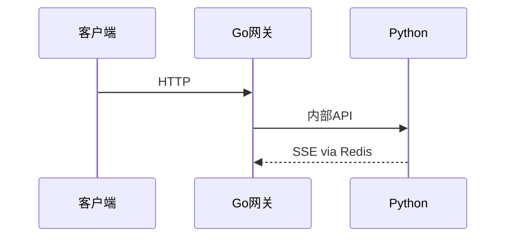

# 飞书文档工具

通过 `feishu-docs` CLI 操作飞书文档和云盘。这个 skill 对外保留统一入口，底层优先调用飞书官方 `lark-cli`；不要在业务 skill 里直接散写 `lark-cli` 命令。

所有官方 CLI 调用默认带 `LARK_CLI_NO_PROXY=1`，避免代理污染内网/飞书请求。

## 可用命令

### 读取文档
```bash
node /home/node/.claude/skills/feishu-docs/feishu-docs.mjs read <URL或文档ID>
```

支持的 URL 格式:
- `https://xxx.feishu.cn/docx/TOKEN`
- `https://xxx.feishu.cn/wiki/TOKEN`
- 直接传文档 ID

底层使用 `lark-cli docs +fetch --api-version v2 --as bot`。输出为飞书官方返回的文档内容结构，适合保真读取；不要假装复杂表格/图片一定能还原成 Markdown。

### 创建文档
```bash
# 方式1: 内联内容
node /home/node/.claude/skills/feishu-docs/feishu-docs.mjs create "文档标题" "# 内容\n正文..."

# 方式2: 从 stdin 读取（适合长内容）
cat content.md | node /home/node/.claude/skills/feishu-docs/feishu-docs.mjs create "文档标题"
```

输出 JSON: `{ document_id, url, message }`。将 url 分享给用户即可。

底层使用 `lark-cli docs +create --api-version v2 --as bot --content @file`，支持长文和表格，优先用于 PRD/方案文档。

### 追加内容
```bash
# 方式1: 内联内容
node /home/node/.claude/skills/feishu-docs/feishu-docs.mjs append <URL或文档ID> "## 新章节\n正文..."

# 方式2: 从 stdin 读取（适合长内容）
cat append.md | node /home/node/.claude/skills/feishu-docs/feishu-docs.mjs append <URL或文档ID>
```

底层使用 `lark-cli docs +update --api-version v2 --as bot --command append --content @file`。

### 插入图片
```bash
node /home/node/.claude/skills/feishu-docs/feishu-docs.mjs insert-image <URL或文档ID> ./diagram.png --width 900 --caption "流程图"
```

底层优先使用 `lark-cli docs +media-insert --as bot`。如果官方 CLI 当前应用身份缺 `docs:document.media:upload`，工具会自动 fallback 到老飞书 Doc 三阶段链路：创建空 image block → `drive/v1/medias/upload_all` 以 `docx_image` 上传 → `replace_image` 绑定 token。只有两条链路都失败时，才退化为上传 HTML/SVG/PNG 文件并在文档中放链接。

### 插图表：优先 mermaid 白板（可编辑、不截图）

**画流程/时序/状态/类图，首选在正文里直接写 ` ```mermaid ` 代码块**，不要先渲染成 PNG 再 `insert-image`。`create` 和 `append` 都走 `lark-cli docs +create/+update --content` 的导入链路，飞书会把 ` ```mermaid ` 和 ` ```plantuml ` 代码块**自动转成可编辑的白板块**（block_type 为 whiteboard），源码无损保留——用户在飞书里能直接拖拽改图，再 `read` 回来 mermaid 源码原样还在。这比 PNG 截图强：可编辑、可二次维护、文字不会糊。

```bash
# mermaid 直接写进正文，create/append 自动转白板
cat <<'EOF' | node /home/node/.claude/skills/feishu-docs/feishu-docs.mjs create "架构文档"
# 整体架构

下面是请求链路：


EOF
```

**精确更新单张图**用 `lark-cli docs +whiteboard-update`（拿到 whiteboard-token 后覆盖单个白板，不动正文）：
```bash
LARK_CLI_NO_PROXY=1 lark-cli docs +whiteboard-update --as bot \
  --input_format mermaid --source @diagram.mmd --whiteboard-token <TOKEN> --overwrite
```

**⚠️ mermaid 与其他代码块不能混用**：lark-cli 的 markdown 导入器在同一篇文档中遇到多个 ``` 围栏代码块时，会把反引号边界搞混，导致 mermaid 块被当成普通代码块插入（不渲染成图）。规则：

1. **隔离围栏**：文档含 ` ```mermaid ` 块时，其他代码示例必须用行内代码（单反引号）或 4 空格缩进代码块，**禁止用 ``` 围栏**
2. **创建后验证**：创建含 mermaid 的文档后，必须 `read` 回来检查输出里有 `<whiteboard type="mermaid">`；如果出现 `<code>` 或纯文本，说明转换失败
3. **分段写入**：如果确实需要 mermaid 图和围栏代码块共存，先 `create` 只含 mermaid 的部分（确保转白板），再 `append` 含围栏代码块的章节

**什么时候还用 `insert-image` PNG**：mermaid 表达不了的图（如需要像素级精确摆位的手画 SVG、PlantUML 高级皮肤/分层）才退回截图路线。常规架构图/流程图一律 mermaid 白板。

### 上传文件
```bash
# 上传到用户云盘指定目录（推荐）
node /home/node/.claude/skills/feishu-docs/feishu-docs.mjs upload /path/to/file --folder nanoclaw

# 上传到用户云盘根目录
node /home/node/.claude/skills/feishu-docs/feishu-docs.mjs upload /path/to/file
```

文件上传到用户个人云盘。`--folder` 指定目标文件夹（不存在会自动创建）。
输出 JSON: `{ file_token, file_name, size, url, folder, message }`。url 是可直接点击的云盘链接。

底层使用 `lark-cli drive +upload --as bot`。当前 `--folder nanoclaw` 映射到固定 folder token；其他文件夹名需要先补 folder token 映射。

### 搜索文档
```bash
node /home/node/.claude/skills/feishu-docs/feishu-docs.mjs search "关键词"
```

返回匹配的文档列表（JSON 数组）。
底层使用 `lark-cli drive +search --as user`。

## 使用场景

- 用户发了飞书文档链接 → 用 `read` 命令获取内容
- 用户要求写报告/文档 → 先在本地编写内容，再用 `create` 命令创建飞书文档，把链接发给用户
- 用户要求在已有文档后追加内容 → 用 `append`
- 用户要求把图放进文档 → 优先把 SVG/HTML 渲染成 PNG 后用 `insert-image`；如权限不足，上传图件并把链接追加回文档
- 用户要求发文件/保存文件 → 用 `upload --folder nanoclaw` 上传到云盘，把 url 链接发给用户
- 用户要求查找文档 → 用 `search` 命令搜索

## 授权流程

如果工具提示 `FEISHU_AUTH_REQUIRED`，说明用户还没有授权飞书文档访问。按以下步骤处理：

1. 使用 `send_message` 工具发送 `{"type":"feishu_auth_request"}`
2. 告知用户："需要授权飞书文档权限，我已发送授权卡片，请点击卡片中的按钮完成授权。"
3. 用户完成授权后会收到"授权成功"的通知
4. 之后重试之前的飞书文档操作

**不要**在 `FEISHU_AUTH_REQUIRED` 时反复重试工具调用，先请求授权。

## 注意事项

- `create/read/append/insert-image/upload` 优先走官方 `lark-cli`
- `insert-image` 官方链路依赖飞书应用权限 `docs:document.media:upload`；权限不足时自动走旧 user-token 三阶段插图回退
- `search` 需要 `lark-cli` user 身份可用
- 创建的文档会由官方 CLI 给当前 CLI 用户授予管理权限
